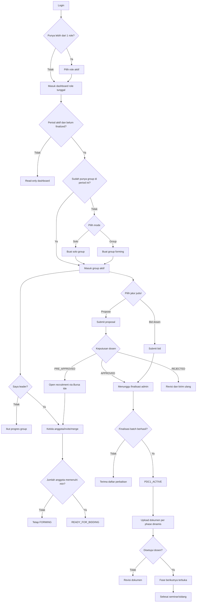
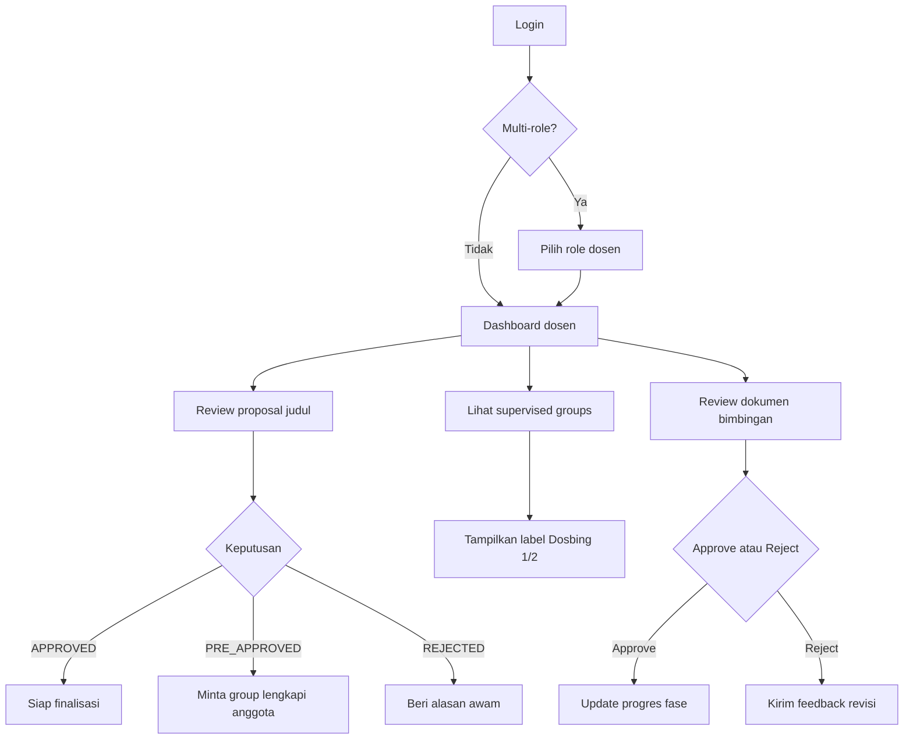
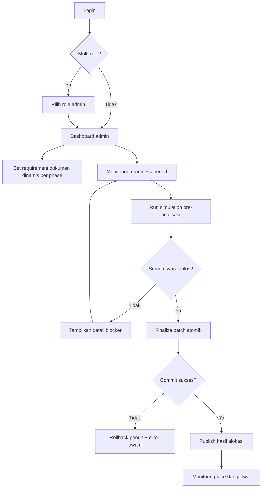

# CAPSTONE #3 - Final Implementation Guide (Anti Bentrok Data)

## 1. Tujuan Dokumen
Dokumen ini menjadi acuan implementasi final agar alur CTMS berjalan konsisten, minim bentrok data, dan terhindar dari case error yang berulang.

Tujuan utama:
- Menyelaraskan flow Mahasiswa, Dosen, dan Admin.
- Menutup edge case pada group forming, bidding, proposal, dan finalisasi batch.
- Menjamin validasi dan transaksi berjalan atomik.
- Menstandarkan pesan error agar mudah dipahami pengguna non-teknis.

## 2. Ruang Lingkup Revisi
Dokumen ini mencakup seluruh poin revisi:
1. Alert message harus awam (non-teknis).
2. Finalize wajib batch dan tidak boleh allocate untuk grup belum memenuhi syarat anggota.
3. Penanganan edge case mahasiswa sudah punya grup lalu ingin join grup lain.
4. Forming hanya untuk yang benar-benar berkelompok, solo diarahkan ke jalur yang tepat.
5. Saat finalize, semua syarat wajib terpenuhi (anggota, judul, dosbing, period readiness).
6. Label supervised group harus jelas: Dosbing 1 / Dosbing 2.
7. Group filter di bimbingan harus terintegrasi penuh backend-frontend.
8. Document types harus terintegrasi ke workflow dokumen.
9. Admin dapat mengatur dokumen wajib upload per phase secara dinamis.
10. User multi-role harus bisa memilih dashboard role aktif.

## 3. Prinsip Wajib (Non-Negotiable)

### 3.1 Konsistensi Data
- Satu sumber kebenaran pembimbing: tabel `supervisions`.
- Field cache di `groups` (supervisor_1_id, supervisor_2_id) hanya turunan sinkron.
- Semua query business-critical wajib scoped by `period_id`.

### 3.2 Integritas Transaksi
- Operasi multi-langkah wajib `DB::transaction()`.
- Operasi rentan race wajib lock urut: User -> Group -> Pivot.
- Tidak boleh ada partial success pada finalisasi batch.

### 3.3 State Governance
- Semua perubahan status grup wajib via `GroupStateMachine`.
- Dilarang ubah status langsung tanpa validasi transisi.

### 3.4 UX Error Policy
- Error message harus:
  - bahasa awam,
  - menyebut penyebab,
  - menyebut tindakan perbaikan.
- Dilarang expose istilah teknis internal (constraint, SQL, stack trace).

## 4. Arsitektur Flow Aman Per Role

## 4.1 Flow Mahasiswa (Aman Bentrok)

## 4.2 Flow Dosen (Aman Bentrok)

## 4.3 Flow Admin (Aman Bentrok)

## 5. Matriks Aturan Validasi Wajib

## 5.1 Group Forming dan Join/Merge
- Satu mahasiswa hanya boleh punya satu membership per period.
- Hanya leader yang boleh melakukan merge group ke ide lain.
- Non-leader dilarang melakukan join request yang memindahkan satu tim.
- Merge hanya boleh antar group status seeker (FORMING / WAITING_SUPERVISOR_APPROVAL) sesuai policy.
- Saat merge:
  - seluruh pending invite/join request lama harus di-invalidasi,
  - source group dibersihkan dari title/bid/proposal yang sudah tidak relevan,
  - operasi wajib atomik.

## 5.2 Bidding dan Proposal
- Bid hanya boleh untuk status READY_FOR_BIDDING.
- Jumlah anggota harus dalam rentang period (`min_group_size` sampai `max_group_size`).
- Limit total judul aktif (bid + proposal) maksimal 3.
- Proposal wajib oleh leader.
- Proposal status:
  - `PENDING` -> `APPROVED` / `PRE_APPROVED` / `REJECTED`.

## 5.3 Finalisasi Batch
- Finalisasi hanya level period, bukan ad-hoc per grup tanpa validasi global.
- Wajib lolos semua:
  - tidak ada mahasiswa terdaftar period yang belum punya group,
  - tiap group memenuhi batas anggota,
  - group memiliki judul valid,
  - group memiliki pembimbing sesuai kebijakan period,
  - state transisi valid.
- Jika 1 grup gagal validasi, batch gagal semua (rollback).

## 5.4 Dokumen Dinamis
- Requirement dokumen wajib didefinisikan per `period_id + phase + document_type`.
- Validasi upload membaca requirement aktif period tersebut.
- Unlock phase membaca kelengkapan requirement phase sebelumnya.
- Fallback `GENERAL` hanya berlaku jika period belum punya requirement eksplisit.

## 5.5 Multi-Role Dashboard
- Saat login, bila user punya lebih dari satu role, tampilkan role picker.
- Simpan role aktif di session/frontend state.
- Semua request dashboard mengikuti role aktif.
- Ganti role harus explicit (switch role), bukan redirect otomatis ke role pertama.

## 6. Katalog Alert Message Awam (Standar)

Gunakan template berikut:
- Format: "[Masalah]. [Apa yang harus dilakukan]."

Contoh:
- "Anda belum bisa bidding karena anggota kelompok belum memenuhi syarat. Tambahkan anggota sampai jumlah minimal terpenuhi."
- "Judul belum dapat difinalisasi karena pembimbing belum lengkap. Lengkapi dosbing 1 dan dosbing 2 terlebih dahulu."
- "Anda sudah terdaftar di kelompok lain pada periode ini. Keluar dari kelompok lama atau hubungi admin."
- "Dokumen belum bisa diunggah karena fase sebelumnya belum disetujui. Selesaikan fase sebelumnya terlebih dahulu."
- "Akun Anda memiliki beberapa peran. Pilih peran yang ingin digunakan sekarang."

## 7. Pencegahan Race Condition dan Bentrok Data

### 7.1 Join/Merge
- Lock urutan tetap: `users` -> `groups` -> `group_members`.
- Re-check idempotensi setelah lock.
- Cegah dua acceptance paralel pada request yang sama.

### 7.2 Finalisasi
- Lock row `period` saat mulai finalisasi.
- Lock row `title` saat cek quota.
- Semua perubahan status, supervision, dan assignment dalam satu transaksi.

### 7.3 Dokumen
- Validasi group ownership di endpoint dosen saat menerima `group_id` filter.
- Tolak akses dokumen jika `group_id` bukan group bimbingan dosen tersebut.

## 8. Integrasi Backend-Frontend yang Harus Sinkron

## 8.1 Backend
Wajib disediakan endpoint/logic final:
- Role picker context: endpoint user mengembalikan daftar role valid.
- Supervised groups mengembalikan role supervision (`SUPERVISOR_1` / `SUPERVISOR_2`).
- Dokumen membaca requirement dinamis period-phase.
- Finalisasi batch menggunakan readiness pre-check tunggal.

## 8.2 Frontend
Wajib diterapkan:
- Role selection screen/modal pasca login multi-role.
- Label Dosbing 1/2 pada daftar supervised groups.
- Filter bimbingan sinkron dengan daftar supervised groups dari backend.
- Seluruh error API ditampilkan dalam bahasa awam konsisten.

## 9. Test Matrix Wajib (Agar Tidak Muncul Error di Produksi)

## 9.1 Feature Test Backend
1. Multi-role login menampilkan pilihan role.
2. Group merge ditolak jika requester bukan leader.
3. Group merge sukses memindahkan tim secara atomik.
4. Bidding ditolak jika anggota < min size.
5. Finalisasi batch rollback penuh jika 1 group invalid.
6. Finalisasi batch commit saat semua group valid.
7. Endpoint dokumen dosen menolak `group_id` di luar supervisi.
8. Requirement dokumen dinamis memblok upload type tidak valid.
9. State transition invalid melempar error terkontrol.
10. Semua error message mengikuti format awam.

## 9.2 Integration Test Frontend
1. User multi-role dapat memilih role aktif.
2. Switch role mengubah dashboard dan menu sesuai role.
3. Halaman bimbingan: filter group tidak menampilkan group non-supervisi.
4. Halaman supervised groups menampilkan label dosbing 1/2.
5. Semua error API muncul dalam pesan awam.

## 9.3 Negative Testing
- Simulasi concurrent accept join request.
- Simulasi finalisasi bersamaan oleh dua admin.
- Simulasi perubahan anggota saat finalisasi berjalan.
- Simulasi requirement dokumen diubah di tengah fase.

## 10. Definition of Done (Checklist Final)

Checklist wajib centang semua sebelum go-live:
- [ ] Semua pesan alert sudah awam dan actionable.
- [ ] Finalisasi hanya via batch period dan atomik.
- [ ] Tidak ada mahasiswa multi-membership dalam satu period.
- [ ] Edge case merge group sudah aman untuk leader-only.
- [ ] Solo dan group forming mengikuti policy final yang disepakati.
- [ ] Finalisasi memverifikasi anggota, judul, dosbing, dan readiness global.
- [ ] Label dosbing 1/2 tampil di UI dosen.
- [ ] Group filter bimbingan terintegrasi backend-frontend.
- [ ] Document type terintegrasi dengan requirement phase dinamis.
- [ ] Admin dapat mengelola requirement dokumen per phase.
- [ ] Multi-role dashboard selector aktif dan stabil.
- [ ] Seluruh test matrix lulus.

## 11. Catatan Implementasi Penting
- Tidak ada sistem yang bisa menjamin nol error absolut, namun guideline ini dirancang untuk menutup seluruh jalur bentrok utama yang sudah teridentifikasi.
- Jika ada kebijakan baru (misal dosbing 2 opsional), update harus dilakukan serentak pada:
  - validasi finalisasi,
  - readiness snapshot,
  - UI indikator kelengkapan,
  - test matrix.

## 12. Governance Update April 2026

Perubahan implementasi yang sudah mulai diterapkan:

1. **Proposal tidak lagi memaksa state `WAITING_SUPERVISOR_APPROVAL`**
- Setelah mahasiswa submit proposal, grup tetap berjalan di jalur normal (`READY_FOR_BIDDING`/`FORMING` sesuai kondisi).
- Sistem menandai status proposal aktif dengan flag `groups.has_active_proposal`.

2. **Normalisasi status approval proposal**
- Enum yang digunakan: `PENDING`, `UNDER_REVIEW`, `APPROVED`, `REJECTED`.
- Status lama `PRE_APPROVED` dimigrasikan ke `UNDER_REVIEW`.

3. **Readiness finalisasi fleksibel per period**
- Ditambahkan `periods.require_all_students_grouped` (default `true`).
- Jika `false`, mahasiswa tanpa grup tidak otomatis memblokir finalisasi batch.

4. **Finalization failure lebih granular**
- Endpoint finalisasi mengembalikan kategori blocker terstruktur (`groups_without_title`, `groups_without_supervisor_1`, dll), bukan pesan umum.

5. **Konsolidasi source role runtime**
- Runtime role check diarahkan ke pivot role (`hasRole` / `roleSlugs`) untuk mengurangi mismatch antara `user.role` legacy dan relasi `roles`.

6. **Supervisor proposal layer eksplisit**
- Entitas `group_supervisor_proposals` tetap menjadi layer proposal dosbing (input preferensi sebelum finalisasi admin).

7. **Stakeholder layer (next step)**
- Belum ada entitas stakeholder dedicated. Perlu ditambahkan sebagai layer arsitektur berikutnya untuk student-proposed title yang melibatkan pihak eksternal.

---
Dokumen ini adalah baseline final implementasi Capstone #3. Gunakan sebagai acuan coding, code review, QA, dan UAT agar flow konsisten lintas role serta aman dari bentrok data.
