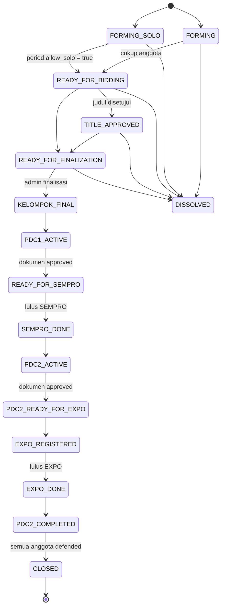

# CTMS Business Flow - Diagram Mermaid

## Overview
Diagram ini mencakup keseluruhan alur bisnis CTMS dari awal (setup sistem) sampai akhir (penutupan periode), dengan pembagian per aktor: **Admin**, **Dosen**, **Mahasiswa**, dan **Sistem**.

## Full Business Flow Diagram

```mermaid
flowchart TB
    subgraph F0["FASE 0: SETUP AWAL"]
        direction TB
        A1["Admin: Create Period"] --> A2["Admin: Config Doc Req"]
        A2 --> A3["Admin: Active Component"]
        A3 --> A4["Admin: Config Grade Weights"]
    end

    subgraph F1["FASE 1: PEMBENTUKAN GRUP"]
        direction TB
        M1["Mahasiswa: Login & pilih periode aktif"] --> M2{"Pilih jalur grup"}
        M2 -->|"Normal"| M3["Buat grup: FORMING"]
        M2 -->|"Solo Seeker"| M4["Buat grup solo: FORMING_SOLO"]
        M2 -->|"Join"| M5["Terima undangan atau Request Bursa Ide"]
        M3 --> M6["Invite anggota"]
        M6 --> S1{"Sistem: sudah cukup anggota?"}
        S1 -->|"Ya"| M7["Status: READY_FOR_BIDDING"]
        S1 -->|"Tidak"| M6
        M4 --> M8["Bisa langsung propose judul tanpa nunggu anggota"]
    end

    subgraph F2["FASE 2: PENENTUAN JUDUL"]
        direction TB
        M7 --> M9{"Strategi judul"}
        M8 --> M9
        M9 -->|"Bid"| M10["Submit bid + prioritas + calon pembimbing"]
        M9 -->|"Propose"| M11["Submit proposal judul ke dosen target"]
        M10 --> D1["Dosen: Review bid"]
        D1 -->|"ACCEPT"| D2["Simpan rekomendasi ACCEPT"]
        D1 -->|"REJECT"| D3["Simpan rekomendasi REJECT"]
        M11 --> D4["Dosen: Review proposal"]
        D4 -->|"APPROVED"| D5["Proposal APPROVED"]
        D4 -->|"UNDER_REVIEW"| D6["Mohon lengkapi anggota atau tunggu tinjauan"]
        D4 -->|"REJECTED"| D7["Proposal REJECTED + alasan revisi"]
        D5 --> M12["Tunggu finalisasi admin"]
        D2 --> M12
    end

    subgraph F3["FASE 3: FINALISASI BATCH"]
        direction TB
        A5["Admin: Monitor readiness per period"] --> A6{"Semua grup lolos validasi?"}
        A6 -->|"Tidak"| A7["Tampilkan blocker per grup"]
        A7 --> A5
        A6 -->|"Ya"| A8["Finalisasi batch ATOMIK"]
        A8 --> A9["Alokasi judul ke grup"]
        A9 --> A10["Assign Supervisor 1 dan 2"]
        A10 --> S2["Sistem: Transisi status grup"]
        S2 -->|"READY_FOR_BIDDING"| S3["KELOMPOK_FINAL"]
        S3 --> S4["PDC1_ACTIVE"]
    end

    subgraph F4["FASE 4: PDC1"]
        direction TB
        M13["Mahasiswa: Upload dokumen PDC1"] --> D8["Dosen Pembimbing: Review dokumen PDC1"]
        D8 -->|"APPROVED"| D9["Trigger cek completion"]
        D8 -->|"REJECTED"| D10["Feedback + alasan revisi"]
        D10 --> M13
        D9 --> S5{"Sistem: Semua requirement PDC1 approved?"}
        S5 -->|"Ya"| S6["Status: READY_FOR_SEMPRO"]
    end

    subgraph F5["FASE 5: SEMPRO"]
        direction TB
        A11["Admin: Jadwalkan SEMPRO"] --> S7["Sistem: Auto-generate evaluation rows"]
        S7 --> M14["Mahasiswa: Ikut SEMPRO"]
        M14 --> D11["Dosen Examiner: Submit evaluasi SEMPRO"]
        D11 --> S8{"Sistem: Semua examiner submit?"}
        S8 -->|"Ya"| S9{"Hasil?"}
        S9 -->|"PASS"| S10["Status: SEMPRO_DONE lalu PDC2_ACTIVE"]
        S9 -->|"FAIL"| S11["Status: PDC1_ACTIVE (retry)"]
    end

    subgraph F6["FASE 6: BIMBINGAN SEMPRO"]
        direction TB
        D12["Dosen Supervisor: Evaluasi BIMBINGAN_SEMPRO"] --> S12{"Sistem: Kedua pembimbing submit?"}
        S12 -->|"Ya"| S13["Grade recalculation"]
    end

    subgraph F7["FASE 7: PDC2 EXPO"]
        direction TB
        M15["Mahasiswa: Upload dokumen PDC2"] --> D13["Dosen: Review dokumen PDC2"]
        D13 -->|"APPROVED"| S14["Status: PDC2_READY_FOR_EXPO"]
        S14 --> A12["Admin: Jadwalkan EXPO"]
        A12 --> S15["Sistem: Auto-generate EXPO evaluations"]
        S15 --> M16["Mahasiswa: Ikut EXPO"]
        M16 --> D14["Dosen Examiner: Evaluasi EXPO"]
        D14 --> S16{"Sistem: Semua examiner submit?"}
        S16 -->|"Ya"| S17{"Hasil?"}
        S17 -->|"PASS"| S18["Status: EXPO_DONE lalu PDC2_COMPLETED"]
        S17 -->|"FAIL"| S19["Retry PDC2"]
    end

    subgraph F8["FASE 8: BIMBINGAN EXPO + MILESTONE"]
        direction TB
        D15["Dosen Supervisor: BIMBINGAN_EXPO dan MILESTONE"] --> S20{"Sistem: Semua evaluasi complete?"}
        S20 -->|"Ya"| S21["Grade recalculation dan Unlock peer review"]
    end

    subgraph F9["FASE 9: TUGAS AKHIR TA DEFENSE"]
        direction TB
        M17["Mahasiswa: Upload TA Draft"] --> D16["Dosen Pembimbing: Review TA Draft"]
        D16 -->|"APPROVE"| S22["Status: TA_READY"]
        D16 -->|"REVISE"| M17
        S22 --> M18["Mahasiswa: Daftar sidang TA. Status: TA_REGISTERED"]
        M18 --> A13["Admin: Jadwalkan TA Defense"]
        A13 --> S23["Sistem: Auto-attach supervisors dan generate evaluations"]
        S23 --> M19["Mahasiswa: Ikut Sidang TA Defense"]
        M19 --> D17["Dosen Examiner: Evaluasi TA Defense"]
        D17 --> S24{"Sistem: Semua examiner submit?"}
        S24 -->|"Ya"| S25{"Hasil?"}
        S25 -->|"PASS"| S26["Status: TA_DEFENDED"]
        S25 -->|"FAIL"| S27["Status: TA_REVISED lalu retry"]
    end

    subgraph F10["FASE 10: PENUTUPAN"]
        direction TB
        D18["Dosen: Mark TA_DEFENDED"] --> S28{"Sistem: Semua anggota grup defended?"}
        S28 -->|"Ya"| S29["Status grup: CLOSED"]
        S28 -->|"Tidak"| M20["Anggota gagal mengulang proses TA"]
        S29 --> S30["Final grade recalculation"]
        S30 --> A14["Admin: Close period"]
    end

    F0 --> F1
    F1 --> F2
    F2 --> F3
    F3 --> F4
    F4 --> F5
    F5 --> F6
    F6 --> F7
    F7 --> F8
    F8 --> F9
    F9 --> F10
```

## Legend / Simbol

| Prefix | Aktor |
|--------|-------|
| **A*** | Admin |
| **D*** | Dosen |
| **M*** | Mahasiswa |
| **S*** | Sistem (auto-transition / auto-generate) |

## Status Grup (State Machine)

## Catatan Penting

1. **Finalisasi batch adalah atomik**: Jika 1 grup gagal validasi, seluruh batch di-rollback.
2. **Solo Seeker**: Status `FORMING_SOLO` bersifat sticky; tidak auto-transition ke `READY_FOR_BIDDING` kecuali `period.allow_solo = true`.
3. **Dokumen requirement dinamis**: Admin mengatur per `period_id + phase + document_type`.
4. **Auto-generate evaluations**: Terjadi saat admin scheduling (SEMPRO, EXPO, TA Defense).
5. **Grade recalculation**: Terpicu otomatis saat semua supervisor evaluations untuk suatu fase sudah lengkap.
6. **TA_DEFENDED**: Grup hanya menjadi `CLOSED` jika **semua** anggota sudah defended.

---

*Dokumen ini dibuat otomatis sebagai referensi visual untuk seluruh business flow CTMS.*
