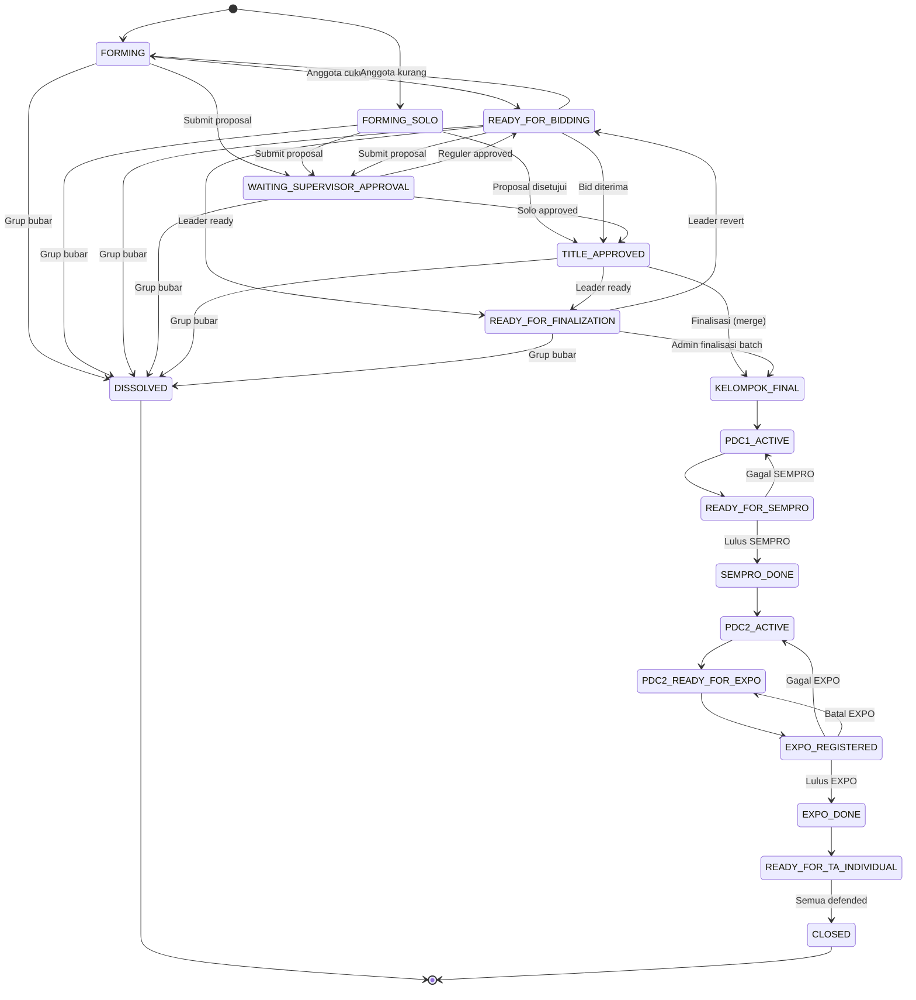
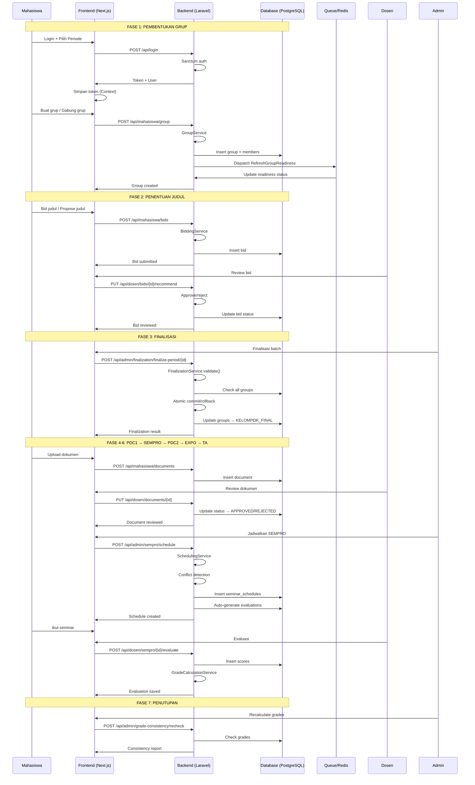
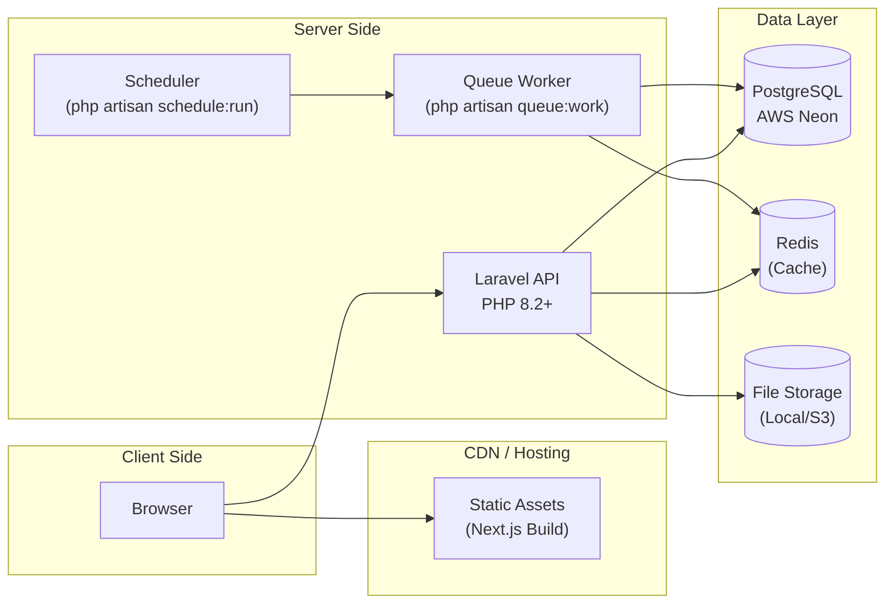
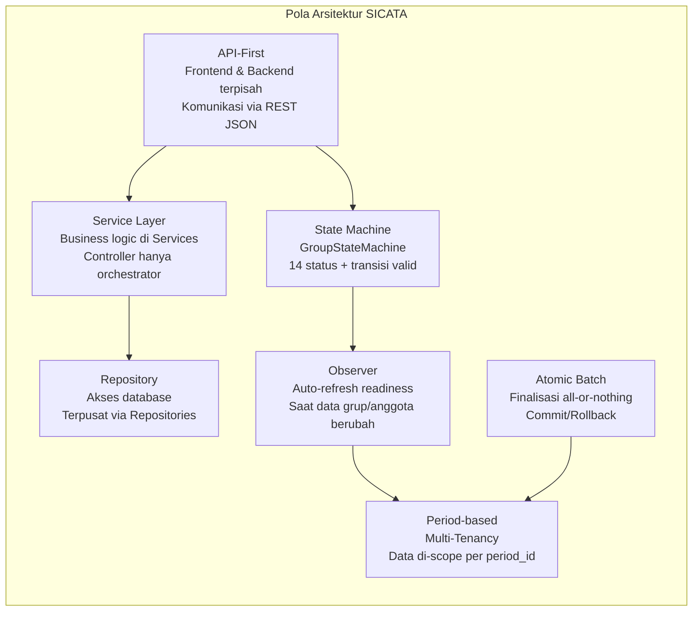

# SICATA — Diagram Arsitektur Sistem

> File ini berisi diagram arsitektur sistem SICATA dalam format Mermaid.
> Buka di GitHub, GitLab, atau editor yang mendukung Mermaid untuk melihat diagram.

---

## 1. Diagram Arsitektur Sistem (System Architecture)

```mermaid
graph TB
    subgraph Actors["Pengguna Sistem"]
        A1[("👤 Admin")]
        A2[("👨‍🏫 Dosen")]
        A3[("👨‍🎓 Mahasiswa")]
    end

    subgraph Frontend["Frontend — Next.js 16 (TypeScript)"]
        direction TB
        F1["App Router<br/>admin/* | dosen/* | mahasiswa/*"]
        F2["Components<br/>Shadcn UI + Radix UI"]
        F3["State Management<br/>React Context + Hooks"]
        F4["API Client<br/>Axios + Bearer Token"]
    end

    subgraph Backend["Backend — Laravel 12 API (PHP 8.2+)"]
        direction TB
        B1["Laravel Sanctum<br/>Token Auth"]
        B2["Middleware<br/>auth:sanctum + role RBAC"]
        
        subgraph Controllers["Controllers (48)"]
            C1["AuthController"]
            C2["Admin Controllers"]
            C3["Dosen Controllers"]
            C4["Mahasiswa Controllers"]
            C5["Shared Controllers"]
        end

        subgraph Services["Service Layer (15)"]
            S1["GroupStateMachine"]
            S2["GroupService"]
            S3["FinalizationService"]
            S4["BiddingService"]
            S5["SchedulingService"]
            S6["GradeCalculationService"]
            S7["WorkflowService"]
            S8["PeerReviewService"]
            S9["NotificationService"]
            S10["AutoMatchmakerService"]
        end

        subgraph Observers["Observers"]
            O1["GroupObserver"]
            O2["GroupMemberObserver"]
            O3["BidObserver"]
        end

        subgraph Jobs["Queue Jobs"]
            J1["RecalculateGroupStatus"]
            J2["RefreshGroupReadiness"]
            J3["RefreshGroupReadinessBatch"]
        end

        subgraph Models["Eloquent Models (49)"]
            M1["User | Role | Period"]
            M2["Group | GroupMember"]
            M3["Title | Bid | Supervision"]
            M4["Document | DocumentType"]
            M5["Schedule | SeminarSchedule"]
            M6["ExpoEvent | ExpoRegistration"]
            M7["TaSubmission | TaDefenseSchedule"]
            M8["Assessment Components"]
            M9["PeerReview | PeerReviewIndicator"]
            M10["Notification | AuditLog"]
            M11["GradeConfiguration | GradeConsistencyCheck"]
            M12["DigitalSignature"]
        end
    end

    subgraph Database["Database Layer"]
        DB1[("PostgreSQL<br/>(Production — AWS Neon)")]
        DB2[("SQLite<br/>(Development Fallback)")]
        DB3[("Redis<br/>(Cache & Queue)")]
    end

    %% Actor Connections
    A1 --> F1
    A2 --> F1
    A3 --> F1

    %% Frontend to Backend
    F4 --> B1
    F4 --> B2

    %% Backend Flow
    B1 --> B2
    B2 --> C1
    B2 --> C2
    B2 --> C3
    B2 --> C4
    B2 --> C5
    
    C1 --> S1
    C1 --> S2
    C2 --> S1
    C2 --> S2
    C2 --> S3
    C2 --> S4
    C2 --> S5
    C3 --> S1
    C3 --> S2
    C3 --> S6
    C3 --> S8
    C4 --> S1
    C4 --> S2
    C4 --> S4
    C4 --> S8
    
    S1 --> M2
    S2 --> M2
    S3 --> M10
    S4 --> M3
    S5 --> M5
    S6 --> M11
    S7 --> M2
    S8 --> M9
    S9 --> M10

    M1 --> DB1
    M2 --> DB1
    M3 --> DB1
    M4 --> DB1
    M5 --> DB1
    M6 --> DB1
    M7 --> DB1
    M8 --> DB1
    M9 --> DB1
    M10 --> DB1
    M11 --> DB1
    M12 --> DB1

    DB1 -.-> DB2
    DB1 -.-> DB3

    %% Observers watch Models
    M2 -.-> O1
    M2 -.-> O2
    M3 -.-> O3
    O1 -.-> J1
    O2 -.-> J2
    O3 -.-> J2
    J1 -.-> M2
    J2 -.-> M2
```

---

## 2. State Machine Grup

---

## 3. Alur Data End-to-End

---

## 4. Deployment Architecture

---

## 5. Pola Arsitektur (Design Patterns)

