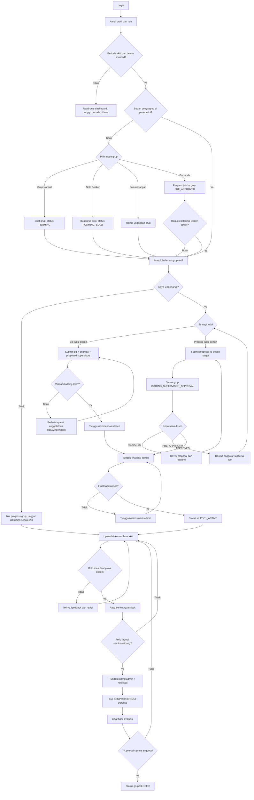
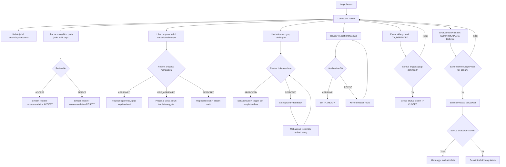
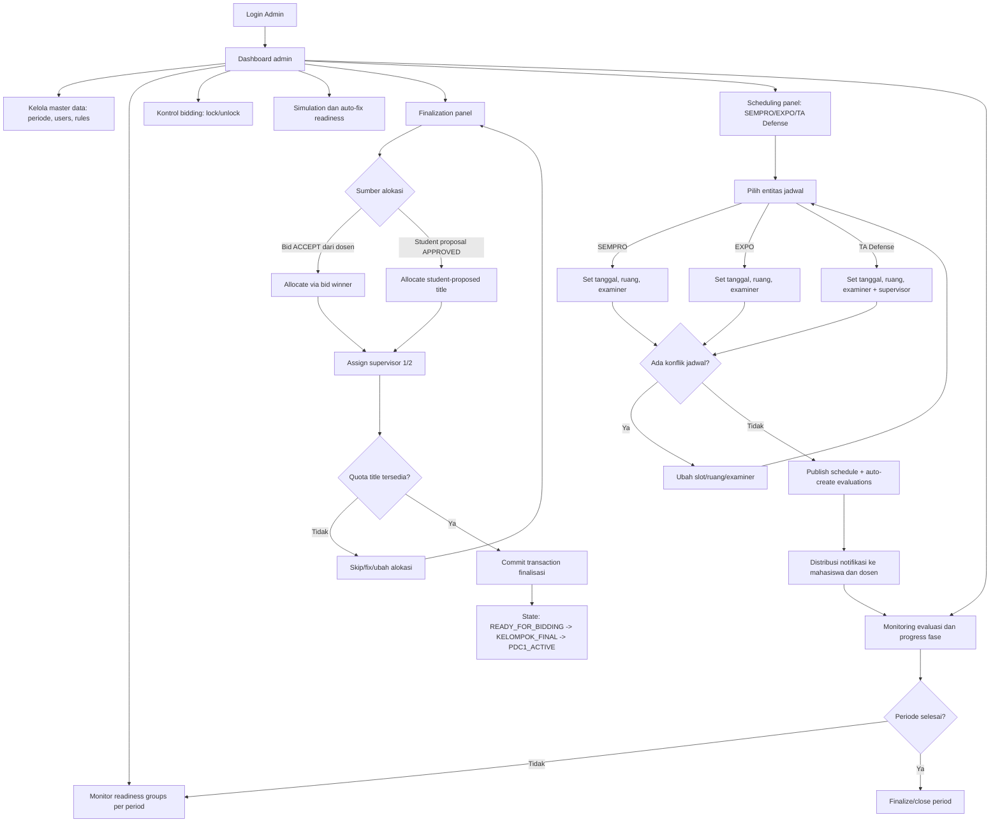
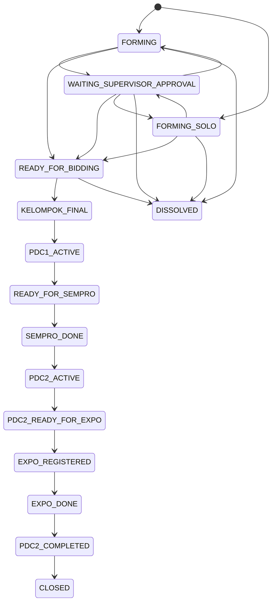

# CTMS End-to-End User Flow dan Business Flow

## 1. Tujuan
Dokumen ini merangkum alur end-to-end CTMS dari sudut pandang:
- User Flow: pengalaman pengguna per role (Mahasiswa, Dosen, Admin).
- Business Flow: aturan bisnis, validasi, state transition, dan keputusan sistem.

## 2. Aktor Utama
- Mahasiswa: membentuk grup, bidding/propose judul, unggah dokumen, daftar seminar/sidang.
- Dosen: mengelola judul, memberi rekomendasi bid, review dokumen, evaluasi seminar/sidang.
- Admin: kelola periode, lock/unlock bidding, finalisasi, scheduling, monitoring akhir periode.

## 3. End-to-End User Flow (Ringkas)

### 3.1 Mahasiswa
1. Login ke sistem.
2. Cek periode aktif (dan belum finalized).
3. Pilih jalur grup:
   - Buat grup normal.
   - Buat grup solo seeker.
   - Terima undangan atau gabung via Bursa Ide.
4. Leader menyiapkan strategi judul:
   - Bid judul dosen, atau
   - Propose judul sendiri ke dosen pembimbing.
5. Menunggu keputusan dosen:
   - Bid diberi rekomendasi ACCEPT/REJECT.
   - Proposal judul APPROVED/PRE_APPROVED/REJECTED.
6. Menunggu finalisasi admin:
   - Alokasi judul + pembimbing.
   - Grup masuk fase proyek aktif.
7. Jalankan fase akademik:
   - Upload dokumen per fase (PDC1 -> SEMPRO -> PDC2 -> EXPO/TA -> SIDANG).
   - Revisi bila ditolak.
8. Ikut seminar/sidang sesuai jadwal admin.
9. Lihat hasil evaluasi dan progres status grup.
10. Penutupan:
   - Setelah seluruh anggota selesai sidang TA, status grup menjadi CLOSED.

### 3.2 Dosen
1. Login ke dashboard dosen.
2. Kelola judul topik yang dibuka.
3. Tinjau incoming bid pada judul miliknya.
4. Beri rekomendasi bid (ACCEPT/REJECT).
5. Tinjau proposal judul mahasiswa (jika dosen diajukan sebagai supervisor):
   - APPROVED jika layak.
   - PRE_APPROVED jika ide layak tetapi anggota belum memenuhi syarat.
   - REJECTED disertai alasan.
6. Review dokumen tiap fase grup bimbingan:
   - APPROVED/REJECTED + feedback.
7. Evaluasi SEMPRO/EXPO/TA defense sesuai penugasan examiner.
8. Review TA draft dan tandai TA_READY / butuh revisi.
9. Tandai TA_DEFENDED ketika sidang selesai.

### 3.3 Admin
1. Login ke dashboard admin.
2. Kelola master data:
   - Periode, user, aturan kuota/batas.
3. Pantau kesiapan grup (readiness).
4. Jalankan kontrol bidding:
   - lock/unlock jika diperlukan.
   - simulation/auto-fix bila ada blocker.
5. Lakukan finalisasi:
   - Alokasi grup ke judul berdasarkan aturan.
   - Tetapkan supervisor.
6. Jadwalkan kegiatan akademik:
   - SEMPRO.
   - EXPO.
   - TA Defense.
7. Pastikan tidak ada konflik jadwal (ruang/waktu/dosen).
8. Monitor hasil evaluasi dan status fase.
9. Final close period saat semua proses selesai.

### 3.4 Diagram Rinci per Role

#### A. Mahasiswa - Detailed User Flow

#### B. Dosen - Detailed User Flow

#### C. Admin - Detailed User Flow

## 4. Business Flow Inti

### 4.1 Onboarding dan Group Formation
1. Sistem hanya mengizinkan aksi pada period aktif dan belum finalized.
2. Mahasiswa tidak boleh punya lebih dari satu membership pada period yang sama.
3. Leader-only actions:
   - add/remove member,
   - submit bid,
   - submit proposal.
4. Status awal grup:
   - FORMING untuk grup normal.
   - FORMING_SOLO untuk solo seeker.

### 4.2 Dual Path Judul (Bidding vs Propose)
1. Path A - Bidding judul dosen:
   - Prasyarat: status grup READY_FOR_BIDDING.
   - Cek min anggota, window bidding, lock status, dan batas total 3 (bid + proposal).
   - Dosen memberi rekomendasi ACCEPT/REJECT.
2. Path B - Propose judul mahasiswa:
   - Leader submit proposal ke dosen target.
   - Status grup pindah ke WAITING_SUPERVISOR_APPROVAL.
   - Dosen memutuskan APPROVED / PRE_APPROVED / REJECTED.
   - PRE_APPROVED dapat dilanjutkan setelah komposisi anggota terpenuhi (dapat via Bursa Ide).

### 4.3 Readiness dan Gating
1. Readiness menjadi syarat sebelum grup masuk bidding/finalisasi.
2. Snapshot readiness dipakai sebagai cache/status view, bukan sumber logika utama.
3. Business rules penting:
   - validasi period_id,
   - state transition harus valid,
   - operasi multi-step dibungkus transaction.

### 4.4 Finalization (Admin Authority)
1. Admin mengeksekusi finalisasi dari data bid/proposal yang valid.
2. Ketika alokasi sukses:
   - title_id ditetapkan,
   - supervisor 1/2 ditetapkan,
   - bid pemenang ACCEPTED, bid lain REJECTED.
3. State progression pasca finalisasi:
   - READY_FOR_BIDDING -> KELOMPOK_FINAL -> PDC1_ACTIVE.
4. Tersedia simulation mode, auto-fix, dan force-ready untuk edge case operasional.

### 4.5 Fase Dokumen dan Progress Akademik
1. Unlock fase mengikuti prereq:
   - PDC1 -> SEMPRO -> PDC2 -> EXPO/TA -> SIDANG.
2. Upload dokumen hanya di fase yang unlocked.
3. Dosen review dokumen:
   - APPROVED membuka fase berikutnya (sesuai requirement),
   - REJECTED memicu revisi.
4. Transisi otomatis contoh:
   - PDC1 complete: PDC1_ACTIVE -> READY_FOR_SEMPRO.
   - PDC2 complete: PDC2_ACTIVE -> PDC2_READY_FOR_EXPO.

### 4.6 Scheduling dan Evaluasi
1. Admin membuat jadwal SEMPRO/EXPO/TA defense.
2. Sistem validasi konflik:
   - bentrok dosen (examiner/supervisor),
   - bentrok ruangan/waktu.
3. Saat jadwal dibuat, sistem auto-generate evaluation rows.
4. Examiner submit evaluasi masing-masing sampai seluruh evaluator complete.

### 4.7 TA Submission sampai Closing
1. Mahasiswa upload TA draft saat grup minimal PDC2_ACTIVE.
2. Dosen review:
   - APPROVE -> TA_READY,
   - REVISE -> mahasiswa revisi ulang.
3. Mahasiswa daftar sidang TA saat window TA buka dan syarat terpenuhi.
4. Admin jadwalkan TA defense.
5. Setelah sidang, dosen menandai TA_DEFENDED.
6. Jika semua anggota grup TA_DEFENDED, grup transition ke CLOSED.

## 5. State Flow Utama Grup

## 6. Swimlane Business Flow (End-to-End)

```mermaid
flowchart LR
    A[Mahasiswa: Login + pilih periode] --> B[Mahasiswa: Bentuk grup]
    B --> C{Jalur Judul}

    C -->|Bid Judul Dosen| D[Mahasiswa Leader submit bid]
    C -->|Propose Judul Sendiri| E[Mahasiswa Leader submit proposal]

    D --> F[Dosen: rekomendasi ACCEPT/REJECT]
    E --> G[Dosen: approve/pre-approve/reject]

    F --> H[Admin: cek readiness + lock/window]
    G --> H

    H --> I[Admin: finalisasi alokasi + assign supervisor]
    I --> J[Group status ke PDC1_ACTIVE]

    J --> K[Mahasiswa: upload dokumen per fase]
    K --> L[Dosen: review APPROVED/REJECTED]
    L --> M[System: unlock fase berikutnya]
    M --> N[Admin: jadwalkan SEMPRO/EXPO/TA defense]
    N --> O[Dosen Examiner: submit evaluasi]
    O --> P[Mahasiswa: upload/review TA dan daftar sidang]
    P --> Q[Dosen: mark TA_DEFENDED]
    Q --> R[System: jika semua anggota defended -> CLOSED]
```

## 7. KPI Operasional yang Disarankan
- Conversion rate FORMING -> READY_FOR_BIDDING.
- Lead time READY_FOR_BIDDING -> PDC1_ACTIVE (efektivitas finalisasi).
- Rata-rata siklus review dokumen (submit -> approve).
- Konflik jadwal per periode (indikator kualitas perencanaan).
- Rasio proposal mahasiswa APPROVED vs REJECTED.
- Rasio grup CLOSED terhadap total grup aktif periode.

## 8. Titik Risiko dan Kontrol
- Risiko: deadlock saat operasi multi-entitas.
  - Kontrol: transaction + lock order konsisten.
- Risiko: status lompat tanpa validasi.
  - Kontrol: state machine sebagai guard transisi.
- Risiko: alokasi judul melebihi kuota.
  - Kontrol: row lock + quota validation saat finalisasi.
- Risiko: data lintas periode tercampur.
  - Kontrol: period scoping wajib pada query kritikal.

## 9. Checklist Implementasi Produk/Operasional
- Semua halaman menampilkan period aktif yang sedang dipakai.
- Semua aksi leader-only ditandai jelas pada UI.
- Semua pesan gagal menampilkan alasan bisnis yang actionable.
- Dashboard admin menampilkan readiness blocker sebelum finalisasi.
- Notifikasi aktif untuk momen penting: invitation, approval, schedule, review.
- Monitoring KPI dibuat per periode untuk evaluasi kurikulum.
